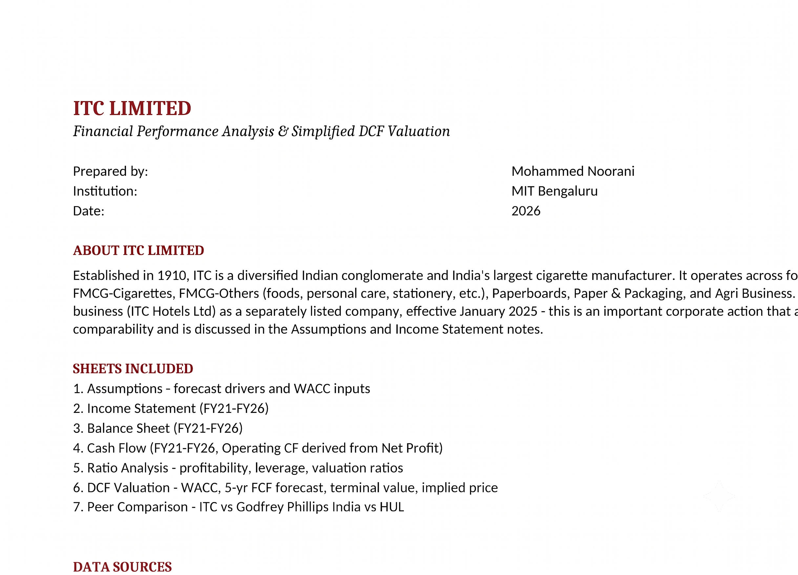
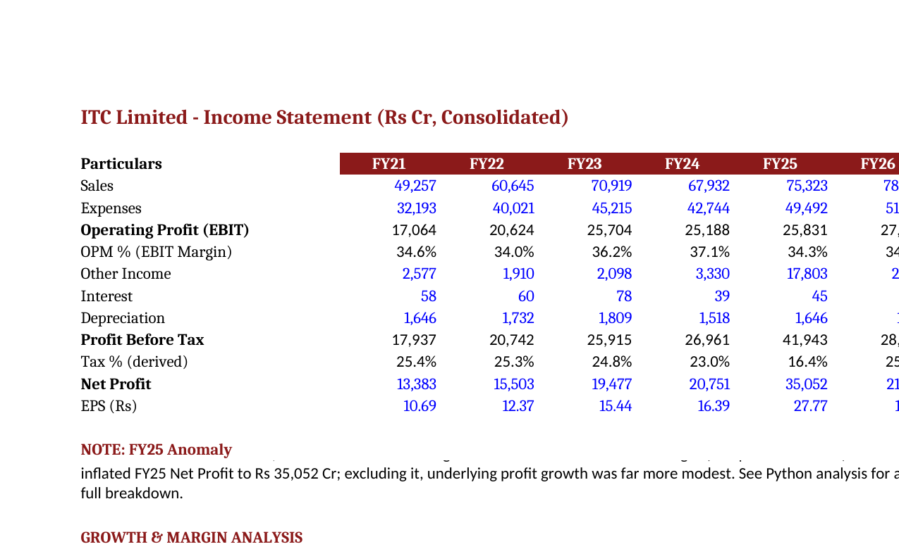
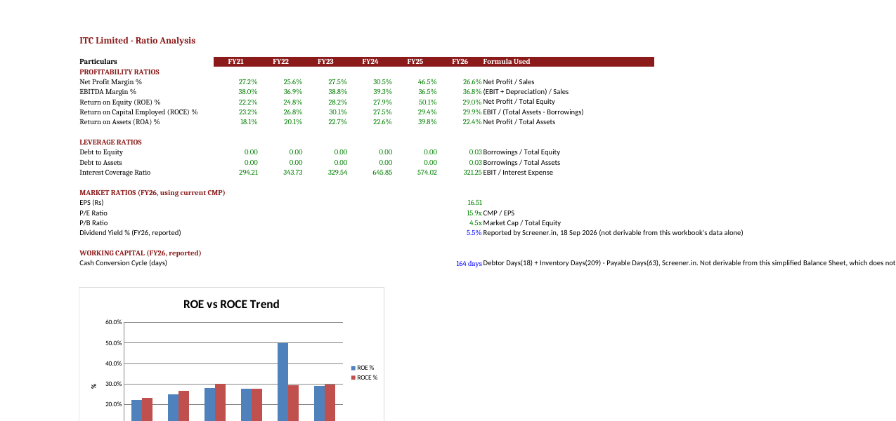
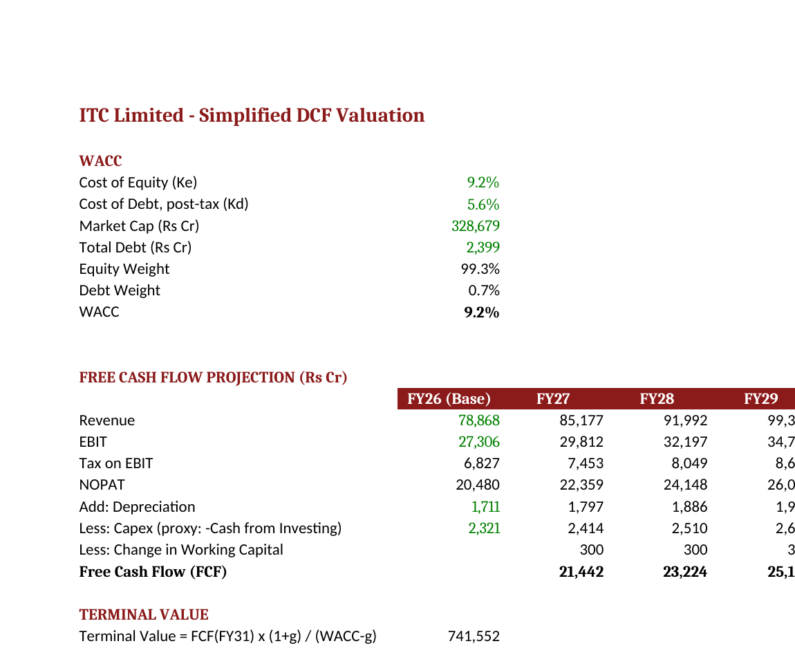
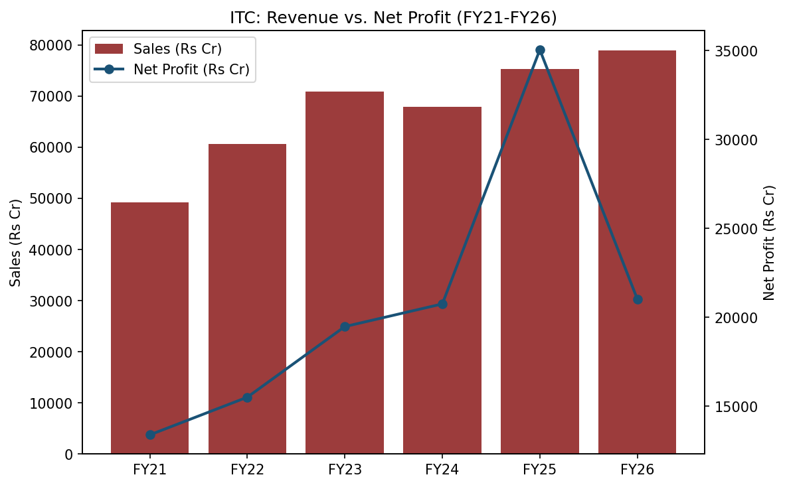

# ITC Limited — Financial Analysis & Simplified DCF

A self-directed financial analysis project on ITC Limited using historical financial data, Excel, and Python.

The project focuses on understanding financial statements, profitability and leverage ratios, historical trends, peer comparison, and a simplified Discounted Cash Flow (DCF) valuation.

---

## Objective

The objective of this project was to apply basic financial-analysis concepts to a real publicly listed company and understand how historical financial performance can be evaluated using Excel and Python.

The analysis covers FY21–FY26 and includes:

* Historical financial statement analysis
* Revenue and profit growth
* Profitability and leverage ratios
* Cash-flow analysis
* Peer comparison
* A simplified 5-year DCF valuation
* Python-based analysis of an unusual movement in reported profit

This is an educational/student project and is intentionally kept at a manageable level rather than being an institutional or investment-banking-grade financial model.

---

## Company

ITC Limited is a diversified Indian company with businesses across cigarettes, FMCG, paperboards and packaging, and agri-business.

An important event during the period analyzed was the demerger of ITC's Hotels business, which became separately listed in January 2025. This affects the comparability of some historical figures, particularly FY25 reported profit and certain balance-sheet items.

The project therefore does not interpret year-on-year changes mechanically and includes a separate analysis of the FY25 profit anomaly.

---

## Project Contents

### Excel

`excel/ITC_Financial_Model.xlsx`

The Excel model contains:

* Historical Income Statement (FY21–FY26)
* Historical Balance Sheet (FY21–FY26)
* Simplified Cash Flow analysis
* Growth and margin analysis
* Profitability and leverage ratios
* Peer comparison
* Simplified DCF valuation
* WACC and valuation assumptions
* Basic sensitivity analysis

The workbook is formula-driven, with assumptions and calculations linked across sheets.

### Python

`python/itc_analysis.ipynb`

Python is used for:

* Loading and inspecting the financial dataset
* Reproducing key financial calculations
* Calculating growth and profitability metrics
* Visualizing revenue, profit and margin trends
* Comparing selected peer metrics
* Investigating the FY25 reported-profit anomaly

Libraries used:

* pandas
* NumPy
* Matplotlib

### Data

`data/itc_financials.csv`

Historical consolidated financial data used in the analysis.

---

## Key Analysis

### 1. Revenue Growth

ITC's revenue increased over the FY21–FY26 period, producing approximately a 9.9% five-year CAGR.

The FY21 starting point was affected by the COVID period, so the CAGR should be interpreted with that base effect in mind.

### 2. Operating Margins

ITC maintained relatively high operating margins throughout the period analyzed.

The high margin profile is strongly influenced by the economics of its cigarette business.

### 3. FY25 Profit Anomaly

One of the main observations from the analysis is the unusually large increase in reported profit in FY25.

Reported net profit increased substantially, but this was not representative of a similar increase in the underlying operating business.

A significant increase in Other Income was associated with the ITC Hotels demerger.

The Python analysis therefore separates the reported profit movement from the underlying operating trend and estimates that normalized FY25 profit growth was considerably lower than the headline growth rate.

This was an important reminder that reported net profit should be analyzed alongside its underlying components rather than interpreted in isolation.

### 4. Leverage and Returns

ITC has relatively low financial leverage in the period analyzed.

The project calculates measures including:

* ROE
* ROCE
* ROA
* Debt-to-Equity
* Debt-to-Assets
* Interest Coverage

These are used to understand profitability and the company's balance-sheet structure.

### 5. Peer Comparison

Selected metrics are compared with:

* Godfrey Phillips India
* Hindustan Unilever

The comparison focuses on operating margin, profitability, ROE and valuation multiples.

The purpose is descriptive rather than to determine which company is a better investment.

---

## Simplified DCF

The project includes a basic DCF valuation to understand the mechanics of intrinsic-value modelling.

The simplified process is:

```text
Revenue
   ↓
EBIT
   ↓
Tax on EBIT
   ↓
NOPAT
   ↓
+ Depreciation
- Capex proxy
- Change in Working Capital
   ↓
Free Cash Flow
   ↓
Discount using WACC
   ↓
Terminal Value
   ↓
Enterprise Value
   ↓
Less: Debt
   ↓
Equity Value
   ↓
Implied Share Price
```

The DCF uses simplified assumptions for revenue growth, operating margin, tax rate, WACC and terminal growth.

The valuation should therefore be treated as a learning exercise and not as an investment recommendation.

The model also includes a small WACC sensitivity analysis to show how changes in the discount rate affect the implied value.

---

## Important Data Considerations

### ITC Hotels Demerger

ITC's Hotels business was demerged and separately listed in January 2025.

This affects the comparability of certain historical figures.

In particular:

* FY25 includes a significant Other Income item related to the demerger.
* Certain balance-sheet items changed following the separation of the Hotels business.
* FY24 revenue also reflects the treatment of discontinued operations.

These effects are documented in the Excel model and considered in the Python analysis.

### Cash Flow Simplification

Operating cash flow in the model is simplified as:

```text
Net Profit + Depreciation
```

This is intended to demonstrate the treatment of depreciation as a non-cash expense.

It is not intended to reproduce the company's reported CFO exactly, because a full cash-flow statement also incorporates working-capital changes and other adjustments.

Cash from Investing is also treated as a rough capex proxy in the simplified DCF and should not be interpreted as pure capital expenditure.

### Balance Sheet Rounding

Some historical balance-sheet totals may differ by approximately ₹1–2 Cr because the underlying third-party financial data is independently rounded.

No artificial adjustment has been made to hide these small differences.

---

## Data Sources

Historical consolidated financial data and selected market/peer data were obtained from publicly available sources, primarily Screener.in.

Additional market inputs used for the DCF include publicly available estimates for:

* Risk-free rate
* Beta
* Equity risk premium

The relevant source and date are documented in the Excel assumptions sheet.

---

## Project Structure

```text
ITC-Financial-Analysis/
│
├── data/
│   └── itc_financials.csv
│
├── excel/
│   └── ITC_Financial_Model.xlsx
│
├── python/
│   └── itc_analysis.ipynb
│
├── screenshots/
│   ├── excel_cover.png
│   ├── income_statement.png
│   ├── ratio_analysis.png
│   ├── dcf.png
│   └── python_analysis.png
│
└── README.md
```

---

## Screenshots

### Excel Model









### Python Analysis



---

## Tools Used

* Microsoft Excel
* Python
* pandas
* NumPy
* Matplotlib

---

## Inspiration & Acknowledgement

This project was developed as a learning exercise inspired by publicly available financial-modelling projects on GitHub.

The original reference material was used to understand the structure and scope of a financial-analysis project. The project was then adapted for ITC Limited, with the financial data, analysis, Python work, assumptions, documentation and presentation developed for this implementation.

---

## Limitations & Possible Improvements

The project intentionally uses a simplified scope.

With additional time, it could be extended with:

* A more detailed working-capital-driven cash-flow model
* More detailed capex extraction
* More detailed segment-level analysis
* Bull/base/bear operating scenarios
* A more detailed DCF sensitivity framework
* More granular peer valuation analysis

These extensions were not necessary for the objective of this project.

---

## Disclaimer

This project is for educational purpose only.

The DCF output and other valuation metrics are based on simplified assumptions and should not be interpreted as investment advice or a recommendation to buy or sell any security.
